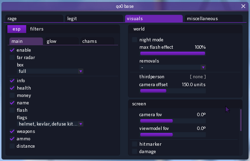

# qo0-base
<a href="https://github.com/rollraw/qo0-base/issues"></a>
<a href="https://github.com/rollraw/qo0-base/blob/master/LICENSE"></a>

### :space_invader: menu


> menu key is <kbd>HOME</kbd>  
panic key is <kbd>END</kbd>

### :world_map: comments navigation
1. `@note:`
2. `@todo:`
3. `@test: [things to test] [date]`
4. `@credits:`
5. `@xref:`

#

### :test_tube: conventions
1. prefix classes with 'C' and interfaces classes 'I'
```
CSomeClass
ISomeInterface
```
2. postfix structs with '_t' e.g. `SomeStruct_t`
3. prefix enums with 'E' e.g. `enum ESomeEnum`
4. thirdparty (sdk, dependencies) macroses should be uppercase e.g. `#define SOMEMACROS`
5. prefix own macroses with the first filename character e.g. `#define M_SOMEMATHMACROS`

#

### :page_facing_up: code style
1. all curly braces should be on it's own line
```cpp
if (true)
{
	while (true)
	{
		// something...
	}
}
```

2. the first characters of variables must be like type
```cpp
bool bSomeBool; int iSomeInt; float flSomeFloat; double dbSomeDouble;
char chSomeSymbol; const char* szSomeString (std::string too);
BYTE dSomeByte; DWORD dwSomeDword; unsigned uSomeInt + type (e.g. unsigned long ulOffset);
CSomeClass someClass; CSomeClass* pSomeClass;
```

3. enumerations must inherit type e.g. `enum ESomeEnum : short`

3.1. enumerations members should be uppercase `SOME_ENUM_MEMBER = 0`

4. includes paths must be separated with one slash *`additional:` file names preferably be lowercase*

5. use number literal's (uppercase)
```cpp
long lSomeLong = 0L;
unsigned int uSomeOffset = 0x0; // hex
unsigned int uSomeInt = 0U;
unsigned long ulSomeULong = 0UL;
```

6. use c-style casts `int* pSomePointer = *(int**)pSomeAddress;`

#

### :bookmark: preproccesor definitions
1. `_DEBUG 1` - disable string encryption enables console logs (automatic switches with compilation configuration)
2. `NDEBUG 1` - fully disables debug, opposite of _DEBUG (automatic switches with compilation configuration)
3. `DEBUG_CONSOLE 1` - enables external console logging but deactivates file logging

#

### :balloon: additional dependencies
1. [dear imgui](https://github.com/ocornut/imgui/)
2. [json](https://github.com/nlohmann/json/)
3. [freetype font rasterizer](https://www.freetype.org/)
4. [{fmt} formatting](https://github.com/fmtlib/fmt/)
5. [minhook](https://github.com/TsudaKageyu/minhook)